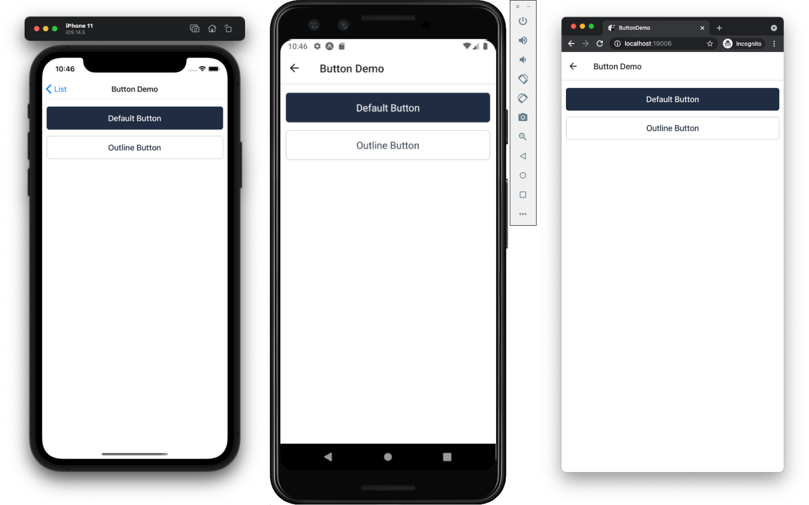

# Roomusic App

L'aplicació externa complementària al servidor Roomusic.
Aquesta ens permetrà interactuar amb el reproductor web per afegir cançons a la cua de reproducció en directe!

La millor manera de fer les festes (o reunions d'amics, per als més responsables) més dinàmiques...
Si ets el DJ de la festa, ja no tindràs el típic amic demanant que li posis la seva cançó preferida.

## Usage

> Be sure to have the [Expo CLI](https://docs.expo.io/workflow/expo-cli/) installed.

```bash
expo init --template @react-native-school/expo-template
```

- Run on iOS: `yarn ios` or `npm run ios`
- Run on Android: `yarn android` or `npm run android`
- Run on Web: `yarn web` or `npm run web`
- Run Tests: `yarn test` or `npm run test`
- Lint Code: `yarn lint` or `npm run lint`
- Format Code: `yarn format` or `npm run format`

## Screenshots

List Screen


Text Screen


Form Screen


Button Screen

